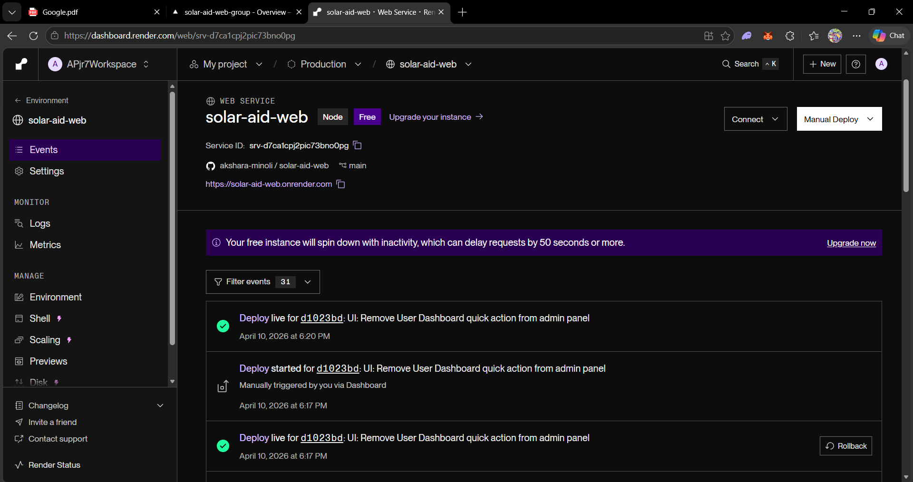
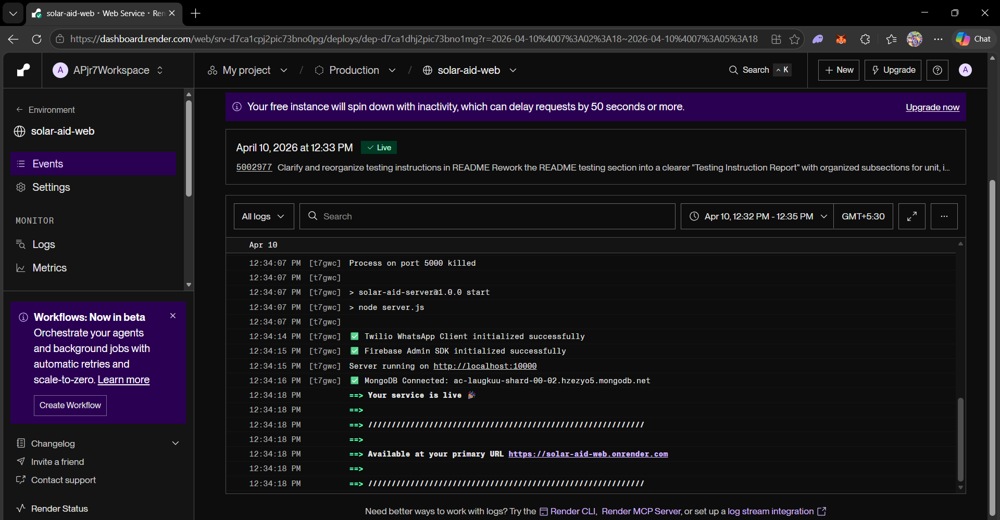
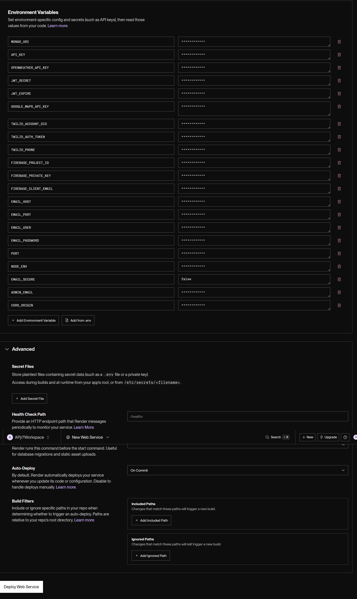
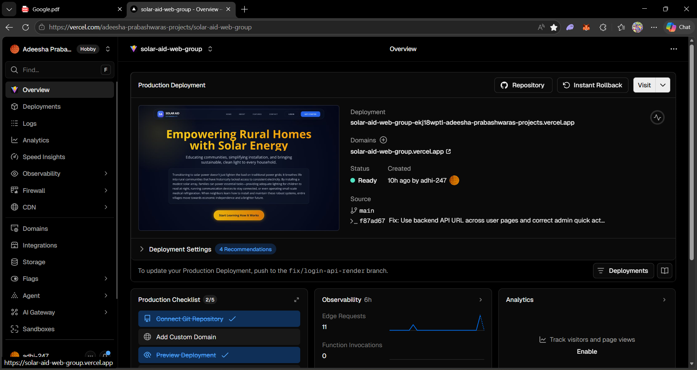
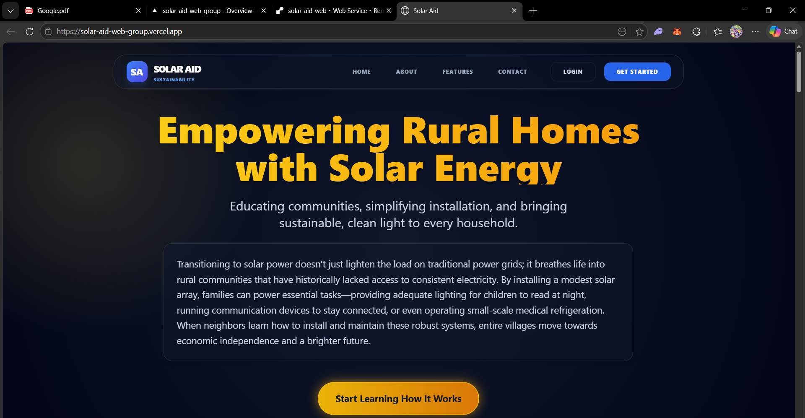
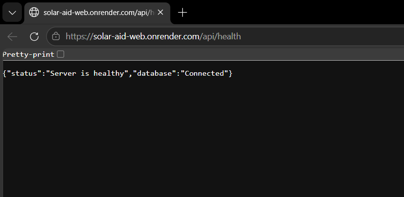
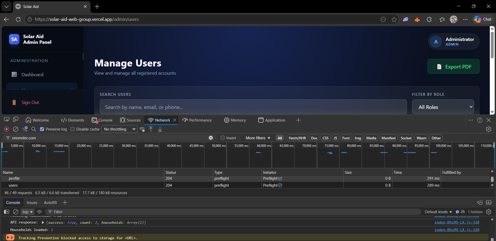

# Solar Aid Web

A full-stack web application for solar energy management and analysis using the MERN stack with modern development tools.

## Tech Stack

- **Frontend:** React 18 + Vite
- **Backend:** Node.js + Express.js
- **Database:** MongoDB
- **Additional Tools:** Axios, React Router, TailwindCSS (optional)

## Project Structure

```
solar-aid-web/
├── client/                 # React frontend (Vite)
│   ├── src/
│   ├── public/
│   ├── index.html
│   ├── package.json
│   └── vite.config.js
├── server/                 # Express backend
│   ├── routes/
│   ├── models/
│   ├── controllers/
│   ├── middleware/
│   ├── server.js
│   └── package.json
├── README.md
├── .gitignore
└── .env.example
```

## Setup Instructions

### Prerequisites

- Node.js (v14 or higher)
- npm or yarn
- MongoDB (local or MongoDB Atlas)
- Git

### Installation

1. **Clone the repository:**
   ```bash
   git clone <repository-url>
   cd solar-aid-web
   ```

2. **Setup Backend:**
   ```bash
   cd server
   npm install
   cp ../.env.example .env
   # Edit .env with your MongoDB URI and other configurations
   npm run dev
   ```
   The backend will run on `http://localhost:5000` (or as configured)

3. **Setup Frontend:**
   ```bash
   cd ../client
   npm install
   cp ../.env.example .env.local
   # Update environment variables if needed
   npm run dev
   ```
   The frontend will run on `http://localhost:5173`

### Running the Application

**Development Mode:**
- Backend: `cd server && npm run dev`
- Frontend: `cd client && npm run dev`

**Production Build:**
- Backend: `npm start`
- Frontend: `npm run build`

## Git Workflow Rules for Group Members

### Branch Naming Convention
- Feature branches: `feature/feature-name`
- Bug fixes: `bugfix/bug-name`
- Hotfixes: `hotfix/hotfix-name`
- Example: `feature/user-authentication`, `bugfix/login-error`

### Commit Message Guidelines
Follow conventional commits format:
```
type(scope): description

feature: Add new feature
fix: Fix a bug
docs: Update documentation
style: Format code
refactor: Refactor code
test: Add tests
chore: Update dependencies
```

### Pull Request Process
1. Create a feature branch from `main`
2. Make your changes with clear, atomic commits
3. Push to your branch
4. Create a Pull Request with a descriptive title and description
5. Request review from at least one team member
6. Address review comments
7. Merge only after approval
8. Delete the feature branch after merging

### Code Review Checklist
- [ ] Code follows project style guidelines
- [ ] No console errors or warnings
- [ ] Tests pass (when applicable)
- [ ] Documentation is updated
- [ ] No hardcoded values or secrets

### Important Rules
- **Never push to `main`** - all changes must go through PRs
- Always pull the latest changes before starting new work: `git pull origin main`
- Keep commits small and logical
- Write meaningful commit messages
- Test your changes locally before pushing
- Resolve conflicts promptly

## Testing Instruction Report

### i. How to Run Unit Tests

Unit tests focus on individual functions and service-layer logic to ensure reliable operation without external dependencies.
1. Navigate to the server directory:
   ```bash
   cd server
   ```
2. Run the unit test suite:
   ```bash
   npm run test:unit
   ```

### ii. Integration Testing Setup and Execution

Integration tests verify controllers and database interactions by isolating the test environment using an in-memory MongoDB instance.
1. Navigate to the server directory:
   ```bash
   cd server
   ```
2. Install dependencies (if not already installed):
   ```bash
   npm install
   ```
3. Execute the integration testing suite:
   ```bash
   npm run test
   ```
4. Generate and view the HTML Test Report:
   ```bash
   npm run test:ui
   ```
   *(This command runs the tests and opens `test-report.html` in your browser for detailed logs.)*

### iii. Performance Testing Setup and Execution

Performance testing simulates user traffic and concurrent request handling using Artillery.
1. Ensure the backend server is running:
   ```bash
   cd server
   npm start
   ```
2. In a new terminal, execute the load tests:
   ```bash
   cd server
   npm run test:performance
   ```
   *(Testing targets `/api/health` and base routes with warmup and sustained loading over 30 seconds.)*

### iv. Testing Environment Configuration details

- **Testing Libraries:** Jest, Supertest, mongodb-memory-server, cross-env, jest-html-reporter.
- **Database:** `mongodb-memory-server` creates a temporary, isolated MongoDB database during runtime, ensuring production and development data are protected.
- **Environment Variables:** Handled automatically in `tests/setup.js`. Test-specific `MONGODB_URI` is automatically provisioned. Additional variables like `JWT_SECRET` may still need to be in `server/.env`.

## Environment Variables

See `.env.example` for required environment variables. Create a `.env` file in both `client/` and `server/` directories with your actual values.

### Backend (`server/.env`)

- `MONGO_URI` or `MONGODB_URI`
- `JWT_SECRET`
- `JWT_EXPIRE`
- `CORS_ORIGIN` (optional, comma-separated allowed origins)
- `FIREBASE_PROJECT_ID`
- `FIREBASE_PRIVATE_KEY`
- `FIREBASE_CLIENT_EMAIL`
- `OPENWEATHER_API_KEY`
- `TWILIO_ACCOUNT_SID`
- `TWILIO_AUTH_TOKEN`
- `TWILIO_PHONE`
- `EMAIL_HOST`
- `EMAIL_PORT`
- `EMAIL_SECURE`
- `EMAIL_USER`
- `EMAIL_PASS` (or `EMAIL_PASSWORD`)
- `ADMIN_EMAIL`
- `GOOGLE_MAPS_API_KEY`
- `PORT` (optional in Render)

### Frontend (`client/.env.local`)

- `VITE_API_URL`
- `VITE_API_BASE_URL`

## Deployment Guide (Render + Vercel)

### 1. Local Pre-Check

1. Run backend locally:
   ```bash
   cd server
   npm install
   npm start
   ```
2. Run frontend locally:
   ```bash
   cd client
   npm install
   npm run dev
   ```
3. Confirm frontend requests hit backend successfully.

### 2. Push to GitHub

1. Commit all required code changes.
2. Push to your deployment branch (usually `main`).
3. Ensure Vercel and Render are connected to the same canonical repository.

### 3. Deploy Backend on Render

1. Create a **New Web Service** in Render.
2. Connect your GitHub repository.
3. Use these settings:
   - Root Directory: `server`
   - Build Command: `npm install`
   - Start Command: `npm start`
   - Environment: `Node`
4. Add backend environment variables listed above.
5. Deploy and verify health check:
   - `https://solar-aid-web.onrender.com/api/health`

Notes:
- For `FIREBASE_PRIVATE_KEY`, keep newlines escaped as `\n` in Render.
- Current backend CORS setup supports localhost dev, optional `CORS_ORIGIN`, and secure `*.vercel.app` origins.

### 4. Deploy Frontend on Vercel

1. Import the same GitHub repository in Vercel.
2. Use these settings:
   - Framework Preset: `Vite`
   - Root Directory: `client`
   - Build Command: `npm run build`
   - Output Directory: `dist`
3. Add frontend environment variables:
   - `VITE_API_URL=https://solar-aid-web.onrender.com/api`
   - `VITE_API_BASE_URL=https://solar-aid-web.onrender.com`
4. Deploy and verify frontend loads correctly.

### 5. End-to-End Verification

1. Open frontend URL:
   - `https://solar-aid-web-group.vercel.app`
2. Test authentication and core workflows (households, consultations, weather, profile).
3. In browser Network tab, confirm API calls go to `solar-aid-web.onrender.com`.
4. Confirm no CORS, JSON parsing, or 401/500 regressions.

### 6. Deployment Evidence

1. Render deployment ready



2. Render live service ready



3. Render environment variables configured



4. Vercel deployment ready



5. Live frontend running on Vercel



6. Backend health endpoint JSON response



7. Frontend API success from Network tab



## Live URLs

- Frontend: `https://solar-aid-web-group.vercel.app`
- Backend : `https://solar-aid-web.onrender.com`
- Backend Health: `https://solar-aid-web.onrender.com/api/health`

## Weather Insight Integration

This system integrates OpenWeather API to:
- Provide real-time weather data for Colombo
- Estimate daily solar efficiency based on cloud coverage
- Recommend ideal days for solar installation
- Improve overall solar assessment accuracy

**Security:**
- API key is stored securely in the backend `.env` file
- All API calls originate from the backend to prevent key exposure
- No sensitive keys are exposed to the frontend browser

## Contact & Support

For questions or issues, please contact the project maintainers or create a GitHub issue.

---

**Last Updated:** April 2026
